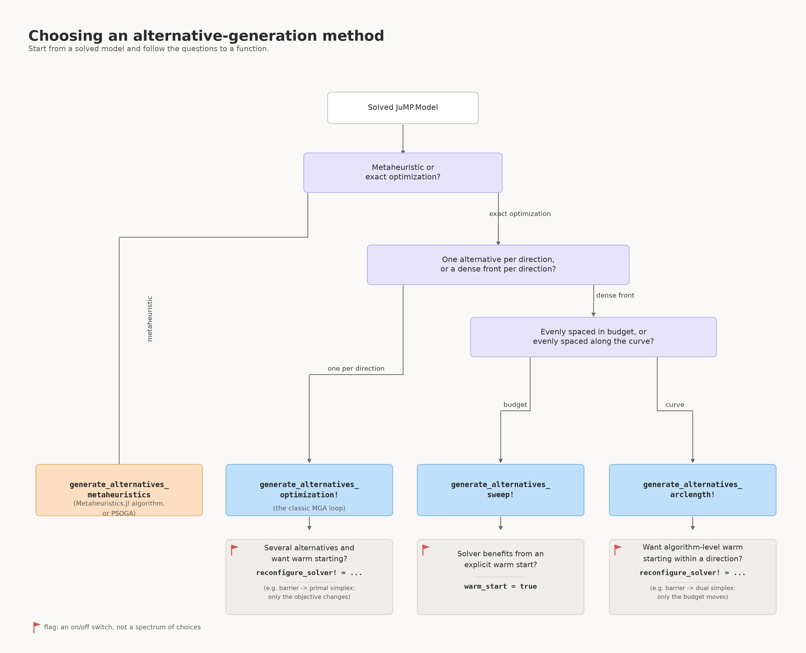

```@contents
Pages = ["12-choosing.md"]
Depth = 5
```

# [Choosing What to Use](@id choosing)

This page answers the three questions you need to answer *before* calling anything: which function, which `modeling_method`, and how many alternatives/directions to ask for. For the mechanics of actually calling each function, see [How to use](10-how-to-use.md); for the theory behind each choice, see [Concepts](30-concepts.md).

## Which function should I use?



**When "metaheuristic" is the right branch, and when it isn't.** Reach for
`generate_alternatives_metaheuristics`/`PSOGA` when your model doesn't have a solver suited to many
repeated exact re-solves (e.g. a black-box or highly nonconvex model where an LP/QP-style optimization
pass isn't available or affordable), or when you specifically want a population-based search that
explores differently from a sequence of directed re-solves. Otherwise, prefer the optimization-based
branch: it is exact, deterministic (given the same solver/settings), and — for models like typical energy
system models, which are usually LPs or convex QPs with plenty of equality constraints (e.g. demand
balance) — considerably cheaper and more reliable, since population-based metaheuristics do not natively
enforce equality constraints and can spend most of their search on infeasible or near-infeasible
individuals (this package's own `PSOGA` inherits that same limitation; see
[PSOGA](@ref psoga-recommendations) in [How to use](10-how-to-use.md) and
[issue #19](https://github.com/TulipaEnergy/NearOptimalAlternatives.jl/issues/19)). If you do go the
metaheuristic route, [Recommended algorithms](@ref metaheuristic-recommendations) gives concrete
starting points instead of the full
[Metaheuristics.jl](https://jmejia8.github.io/Metaheuristics.jl/stable/algorithms/) list.

The flag icon (🚩) in the flowchart marks a binary on/off switch (`warm_start` or `reconfigure_solver!` being set at all), not a spectrum of choices like the questions above it — see [Warm-starting a direction](@ref warm-start-tutorial) once you've picked a function.

See [Alternative-Generation Strategies](@ref gen-strategies) for the theory behind the three optimization-based functions, and [Modeling Methods](@ref modeling-methods) for the `modeling_method` each of them also accepts (independently of the choices above). The table below summarises when to prefer each, since the chart above is clear on *what* you can choose but not on *why* one beats another for your situation:

| Function | Points returned | Prefer it when… | Main limitation | Cost per direction |
| :------- | :--------------- | :--------------- | :--------------- | :------------------ |
| `generate_alternatives_optimization!` | 1 per direction | you just want `n_alternatives` distinct options, nothing more | no visibility into the trade-off *within* a direction — only the full-budget corner | 1 solve |
| `generate_alternatives_sweep!` | `n_budget` per direction, evenly spaced **in cost** | you want the full cost/diversity trade-off and the front is expected to be roughly straight, or you don't want arclength's small predictor-corrector overhead | wastes points on flat stretches, under-samples sharp bends; no built-in solver-warm-start hook (use `warm_start=true` instead, see below) | `n_budget` solves |
| `generate_alternatives_arclength!` | `n_budget` per direction, evenly spaced **along the curve** | the front likely has a knee/bend and you want points concentrated there, not wasted on flat regions; or you want `reconfigure_solver!`-based warm-starting (Section~[Arclength Continuation](@ref arclength-continuation)) | a few extra solves beyond `n_budget` from rejected predictor steps; realised point count per direction can vary slightly | ≈`n_budget` solves + occasional rejected retries |
| `generate_alternatives_metaheuristics` / `PSOGA` | `n_alternatives` total | no suitable exact solver is available, or you want population-based exploration on purpose | stochastic and approximate — no feasibility/exactness guarantee; struggles on equality-heavy models (see above) | population size × iterations (set by you; typically far more model solves/evaluations than one LP re-solve) |

Cost here means LP/QP re-solves for the optimization-based rows, and objective/constraint evaluations for the metaheuristic row — the two are not directly comparable operation-for-operation, but the metaheuristic row is almost always the more expensive one in wall-clock time for a model where an exact re-solve is available at all.

## [Choosing a modeling method](@id choosing-modeling-method)

Once you've picked a function, `modeling_method` (accepted by all three optimization-based functions) picks *which direction* each alternative moves in. See [Modeling Methods](@ref modeling-methods) for the full argument reference and [Optimization-based Methods](@ref opt-based-methods) for the math behind each.

| Method | Prefer it when… | Watch out for |
| :----- | :--------------- | :------------- |
| `:Max_Distance` (default) | you want the single farthest alternative from the optimum, or a small, fixed set of directions with no need to remember earlier alternatives | with many directions, later ones are not informed by earlier ones — no built-in spread-out behaviour |
| `:HSJ` | you want each new alternative to avoid whatever was non-zero last time, cheaply (binary weights, no accumulation) | "forgets" everything before the immediately previous alternative — a single 0/1 signal, coarser than SPORES |
| `:Spores` | you want later alternatives to keep steering away from *everything* explored so far, not just the last one (weights accumulate every iteration) | every scored variable needs a finite upper bound (see the box in [Optimization-based Methods](@ref opt-based-methods)); typically used with `sweep!`/`arclength!`'s larger `n_directions` since the accumulated memory pays off more with more directions |
| `:Min_Max_Variables` | you want a fast, memory-free way to explore many random corners of the feasible region, e.g. for a quick sanity scan | purely random per call — no guarantee two runs, or even two successive alternatives, differ meaningfully; no accumulated diversity pressure |
| `:Random_Vector` | like `:Min_Max_Variables` but you want smoother, continuous perturbations instead of ±1/0 corners | same lack of memory across iterations as `:Min_Max_Variables` |
| `:Directionally_Weighted_Variables` | you want directions chosen consistently with the original objective's own coefficients, to bias toward non-dominated alternatives | weights are redrawn (within the objective-consistent sign ranges) every call, same as `:Min_Max_Variables`/`:Random_Vector` — still stochastic, just constrained |

If you're using a metaheuristic function instead, the equivalent choice is which `metaheuristic_algorithm` to construct — see [Recommended algorithms](@ref metaheuristic-recommendations) and [Using PSOGA](@ref psoga-recommendations) in [How to use](10-how-to-use.md).

## Choosing how many alternatives or directions to request

`n_alternatives`/`n_directions` is the one number every function needs, and there's no universally correct value — it trades runtime directly against how much of the near-optimal region you actually see.

- **Cost is close to linear in this number.** `generate_alternatives_optimization!` pays one extra solve per direction; `generate_alternatives_sweep!`/`generate_alternatives_arclength!` pay `n_budget` extra solves per direction (see the cost column in the function table above). There's no shortcut around this — start small.
- **Start with a handful (3–5) to sanity-check first.** Confirm `optimality_gap` gives you alternatives that are actually diverse and sensible before scaling up — a gap that's too tight makes every direction converge on nearly the same point regardless of how many you request.
- **Methods that accumulate memory reward more directions; methods that don't, reward it less predictably.** `:Spores` and `:HSJ` steer each new direction away from what's already been found, so each additional direction tends to add distinct coverage. `:Min_Max_Variables` and `:Random_Vector` redraw independently every time, so more directions mostly means more chances at overlap — you may need noticeably more of them to cover the same ground, or a method with memory instead.
- **A practical starting point:** pick roughly one direction per technology/investment category you actually want traded off against the others (e.g. one per major generation or storage technology in an energy system model), then look for diminishing returns — if the newest alternatives look like near-duplicates of earlier ones, more directions are unlikely to help; consider a different `modeling_method` instead.
- **`n_budget` is a separate knob from `n_directions`/`n_alternatives`.** It controls how many points you get *within* each direction's front (`generate_alternatives_sweep!`/`generate_alternatives_arclength!` only) and doesn't affect how many directions are explored. The default of `6` is a reasonable start; raise it only if the front looks under-sampled where it bends (arclength spacing already helps with this more than sweep's even-in-budget spacing — see [Arclength Continuation](@ref arclength-continuation)).
