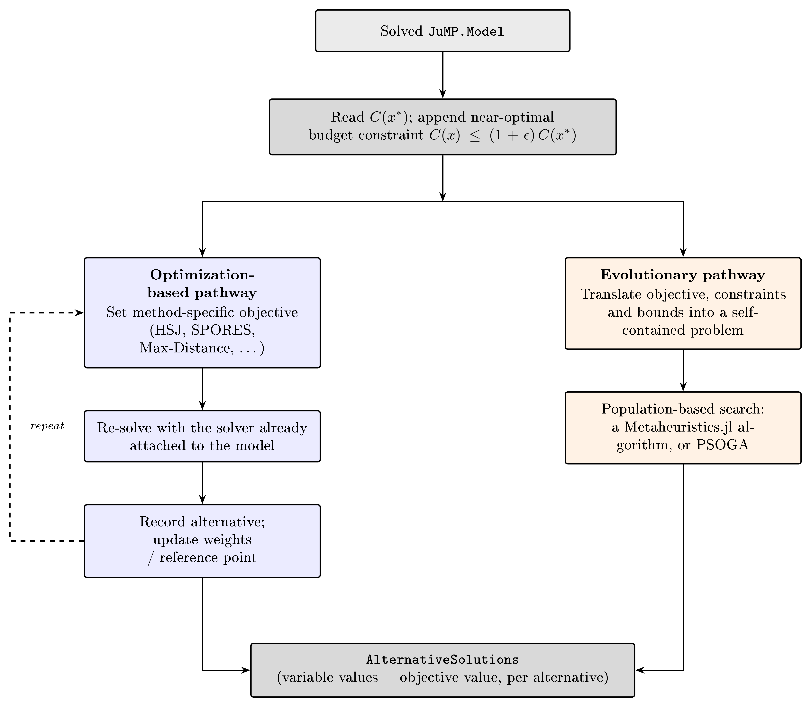

```@meta
CurrentModule = NearOptimalAlternatives
```

# Welcome

[NearOptimalAlternatives.jl](https://github.com/TulipaEnergy/NearOptimalAlternatives.jl) is a package for generating near optimal alternative solutions to a solved [JuMP.jl](https://github.com/jump-dev/JuMP.jl) optimization problem. The alternative solutions are within a maximum specified percentage of the optimum. Alternatives can either be generated using mathematical optimization or metaheuristic algorithms. For the latter, this package depends on [Metaheuristics.jl](https://github.com/jmejia8/Metaheuristics.jl).

This is an implementation of **Modeling to Generate Alternatives (MGA)**, a technique for exploring the *near-optimal region* of an optimization problem rather than reporting only its single optimal solution.
It is aimed in particular at large-scale **energy system models** (capacity expansion, investment, and dispatch models built with JuMP, such as [TulipaEnergyModel.jl](https://github.com/TulipaEnergy/TulipaEnergyModel.jl)), where the optimal solution is often only one of many structurally different, similarly-priced options — and where seeing that spread of near-optimal alternatives (which technologies, which capacities, which trade-offs) matters as much as the single cost-minimal answer.
The package implements several modeling methods for picking each alternative's search direction (Max-Distance, Hop-Skip-Jump, SPORES, Min/Max Variables, Random Vector, Directionally Weighted Variables), several generation strategies for how many points to collect and how to space them (a single point per direction, a budget sweep, or arclength-spaced continuation with solver warm-starting), and population-based metaheuristic search as an alternative to repeated exact re-solves.
See [Choosing What to Use](12-choosing.md) to get started deciding between them, or [How to use](10-how-to-use.md) for a hands-on quick start.

## [System Architecture](@id system-architecture)

Both pathways start from the same solved model and near-optimal budget constraint, then diverge: the optimization-based pathway repeatedly re-solves the same JuMP model with a method-specific objective, while the evolutionary pathway translates the problem once into a self-contained search space for a population-based algorithm. Both converge on the same `AlternativeSolutions` output.



## License

This content is released under the [Apache License 2.0](https://www.apache.org/licenses/LICENSE-2.0) license.

## Contributors

```@raw html
<!-- ALL-CONTRIBUTORS-LIST:START - Do not remove or modify this section -->
<!-- prettier-ignore-start -->
<!-- markdownlint-disable -->
<table>
  <tbody>
    <tr>
      <td align="center" valign="top" width="14.28%"><a href="https://github.com/g-moralesespana"><br /><sub><b>Germán Morales</b></sub></a><br /><a href="#research-g-moralesespana" title="Research">🔬</a> <a href="#ideas-g-moralesespana" title="Ideas, Planning, & Feedback">🤔</a> <a href="#fundingFinding-g-moralesespana" title="Funding Finding">🔍</a> <a href="#projectManagement-g-moralesespana" title="Project Management">📆</a></td>
      <td align="center" valign="top" width="14.28%"><a href="http://www.alg.ewi.tudelft.nl/weerdt/"><br /><sub><b>Mathijs de Weerdt</b></sub></a><br /><a href="#fundingFinding-mdeweerdt" title="Funding Finding">🔍</a> <a href="#projectManagement-mdeweerdt" title="Project Management">📆</a></td>
      <td align="center" valign="top" width="14.28%"><a href="https://github.com/marnoldus"><br /><sub><b>marnoldus</b></sub></a><br /><a href="#research-marnoldus" title="Research">🔬</a> <a href="#code-marnoldus" title="Code">💻</a> <a href="#ideas-marnoldus" title="Ideas, Planning, & Feedback">🤔</a></td>
      <td align="center" valign="top" width="14.28%"><a href="https://github.com/blibliboe"><br /><sub><b>Luuk van de Laar</b></sub></a><br /><a href="#research-blibliboe" title="Research">🔬</a> <a href="#code-blibliboe" title="Code">💻</a> <a href="#ideas-blibliboe" title="Ideas, Planning, & Feedback">🤔</a></td>
      <td align="center" valign="top" width="14.28%"><a href="https://github.com/greg-neustroev"><br /><sub><b>Greg Neustroev</b></sub></a><br /><a href="#research-greg-neustroev" title="Research">🔬</a> <a href="#code-greg-neustroev" title="Code">💻</a> <a href="#review-greg-neustroev" title="Reviewed Pull Requests">👀</a> <a href="#ideas-greg-neustroev" title="Ideas, Planning, & Feedback">🤔</a></td>
      <td align="center" valign="top" width="14.28%"><a href="https://github.com/gnawin"><br /><sub><b>Ni Wang</b></sub></a><br /><a href="#research-gnawin" title="Research">🔬</a> <a href="#code-gnawin" title="Code">💻</a> <a href="#review-gnawin" title="Reviewed Pull Requests">👀</a> <a href="#ideas-gnawin" title="Ideas, Planning, & Feedback">🤔</a> <a href="#projectManagement-gnawin" title="Project Management">📆</a></td>
      <td align="center" valign="top" width="14.28%"><a href="https://github.com/AlexPacurar01"><br /><sub><b>Alexandru Pacurar</b></sub></a><br /><a href="#doc-AlexPacurar01" title="Documentation">📖</a> <a href="#code-AlexPacurar01" title="Code">💻</a></td>
    </tr>
  </tbody>
</table>

<!-- markdownlint-restore -->
<!-- prettier-ignore-end -->

<!-- ALL-CONTRIBUTORS-LIST:END -->
```
